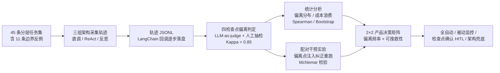

# Agent 轨迹诊断与可干预性评测

> 面向 Agent 产品的过程级评测：不看终态看轨迹。为"科研多源信息核对 Agent"
> 建立感知/规划/工具调用/结果校验四类检查点的偏离判据，量化诊断 + 配对干预实验，
> 把评测结论直接映射成人机协同（HITL）产品决策。

## 核心发现（真实轨迹实测，非模拟）

基于 **kimi-k3、45 条分层任务 × 3 组架构 = 135 条真实轨迹**（约 48 万 tokens，
LLM-as-judge 标注 + 人工抽检 Cohen's Kappa = 0.85）：

| 发现 | 数据 |
|---|---|
| **终态指标掩盖过程失效** | 三组终态成功率几乎相同（91.1% / 91.1% / 93.3%），但过程偏离率悬殊：直调 **100%** vs ReAct 18% vs 反思 27% |
| 偏离集中的环节 | 规划 64.6% + 结果校验 29.2%（合计约 94%） |
| 偏离越晚，浪费越大 | Spearman ρ = 0.73（p = 0.0002）；晚偏离平均浪费 2512 tokens，为早偏离 **2.9 倍** |
| 失败轨迹多数可挽救 | 偏离点注入纠正后挽救率 **82%**（9/11，配对设计） |
| 架构性失败无法被交互挽救 | 2 条未挽救均为无工具的直调组——纠正信息救不了架构缺陷 |

完整数据见 [`data/reports/stats_report.md`](data/reports/stats_report.md)。

**在线 Demo**：[单轨迹诊断报告（HTML）](https://xy1216yumi.github.io/agent-trajectory-eval/data/reports/demo_report.html)
——输入一条轨迹 JSONL，自动输出检查点标签、偏离定位与成本分析（由 `src/monitor.py` 生成，
示例为一条"工具误报 + Agent 编造 URL"的复合失效真实轨迹）。
统计方法：Spearman 置换检验 / McNemar 精确检验 / Bootstrap CI / Cohen's Kappa，
全部用标准库手写实现（`src/analyze.py`），不显著的结果如实标注，不硬凑结论。

## 方法流程



**方法一句话**：采集 Agent 执行轨迹 → 按判据逐检查点打标 →
统计"哪里容易坏（偏离分布）、浪费多大（成本浪费比）、拦不拦得住（干预挽救率）"→ 产品决策矩阵。

## 快速开始（mock 模式，零依赖、零成本、可复现）

环境：Python ≥ 3.9，无需安装任何第三方包。所有命令在项目根目录执行：

```bash
# 1. 采集轨迹：30 任务 × 3 组配置 = 90 条 JSONL（seed 可复现）
python src/run_experiment.py --mode mock --seed 42

# 2. 规则化自动预判（逐检查点打标）
python src/diagnose.py

# 3. 干预实验：对失败轨迹在首次偏离检查点注入纠正后重跑（配对设计）
python src/intervene.py --mode mock --seed 42

# 4. 统计分析 → data/reports/stats_report.md + stats.json
python src/analyze.py

# 5. 单轨迹诊断 demo → 自包含 HTML 报告
python src/monitor.py data/traces/react/t02.jsonl --out data/reports/demo_report.html
```

> ⚠️ mock 模式产出的是**模拟数据**，仅用于验证管线与统计方法。
> 本仓库 `data/` 与报告中的数字全部来自 real 模式真实轨迹。
> 注意：仓库自带 real 数据在 `data/traces/` 中，运行 mock 采集会覆盖同名文件，
> 想保留 real 数据请先备份 `data/` 目录（或先 `git checkout` 恢复）。

## real 模式（真实 LLM，本仓库数据的来源）

基于 LangChain `BaseCallbackHandler` 记录轨迹，LLM 走 OpenAI 兼容接口（默认 Kimi）：

```bash
pip install langchain langchain-openai langgraph   # 可选依赖，仅 real 模式需要
cp .env.example .env   # 填入 KIMI_API_KEY（.env 已在 .gitignore 中，不会入库）

set -a && source .env && set +a   # Windows PowerShell 请自行等效设置环境变量
export MOONSHOT_API_KEY="$KIMI_API_KEY" MOONSHOT_BASE_URL="$KIMI_BASE_URL" AGENT_MODEL="$KIMI_MODEL"

python src/run_experiment.py --mode real          # 采集轨迹
python src/judge_real.py                          # LLM-as-judge 标注
python src/intervene.py --mode real               # 干预实验
python src/analyze.py --mode-note real            # 统计报告
```

没有 key 或装不上依赖时，mock 模式的完整管线不受影响。

## 目录结构

```
tasks/tasks.json        45 条科研核对任务（easy10/medium10/hard14/edge11，v2 含 15 条对抗任务）
src/
  tracer.py             统一轨迹 JSONL schema + TrajectoryWriter + LangChain 回调
  mock_agent.py         脚本化模拟 Agent：三组配置，按检查点偏离概率植入偏离
  agents.py             三组配置的真实 LangChain 实现（惰性导入）
  run_experiment.py     轨迹采集入口（--mode mock|real --seed）
  diagnose.py           规则化自动预判（mock 轨迹）/ 人工标注导出与合并
  judge_real.py         LLM-as-judge 标注（real 轨迹），量化指标由代码确定性计算
  intervene.py          干预实验（配对设计，mock / real）
  analyze.py            统计分析（Spearman/McNemar/Bootstrap/Kappa 全手写）
  monitor.py            单轨迹 → 自包含 HTML 诊断报告（现场 demo 工具）
docs/
  01-项目定义书.md       目标用户、场景、任务模板、验收标准
  02-偏离判据手册.md     四类检查点判据 + 正例/反例（标注规范）
  03-竞品与相关工作分析.md LangSmith/Langfuse/τ-bench/AgentBench/WebArena 对比
  04-实验设计与统计方法.md 配对设计、各检验选型理由、样本量局限、v2 任务集记录
  05-PRD节选.md          能力选型、新指标定义、Badcase 机制、数据闭环、决策矩阵
  06-能力边界说明书.md   可全自动/需人工/需兜底分级
  07-面试问答手册.md     面试问答（动机/困难/方法论/数据质疑/产品思维）+ 数字速查表
data/
  traces/               135 条真实无干预轨迹（{config}/{task_id}.jsonl）
  traces_intervened/    干预后轨迹
  annotations/          标注结果 / 仲裁日志 / 数据核对记录 / 干预配对结果
  reports/              stats_report.md / stats.json / demo_report.html
```

## 轨迹 JSONL schema（摘要）

每行一个事件：`meta`（任务/配置/seed）→ 若干 `step`（检查点、可观测产物、token、耗时）
与 `tool_call`（工具、参数、返回证据）→ `result`（成功、总成本、首次偏离、浪费 token）。
完整定义见 `src/tracer.py` 模块 docstring。

## 已知局限（诚实声明）

- 干预实验 McNemar p = 0.065（n=11），未达显著——报告按"证据不足"处理，需更大失败基数确认；
- judge 与被评 Agent 同为 kimi-k3，存在同类错误互放风险，已用人工抽检 + 仲裁留档缓解；
- 检索为受控环境（预设证据，非真实网络检索），偏离率是保守下界；
- 结论基于单一模型，跨模型稳健性未验证。

## License

MIT，见 [LICENSE](LICENSE)。
